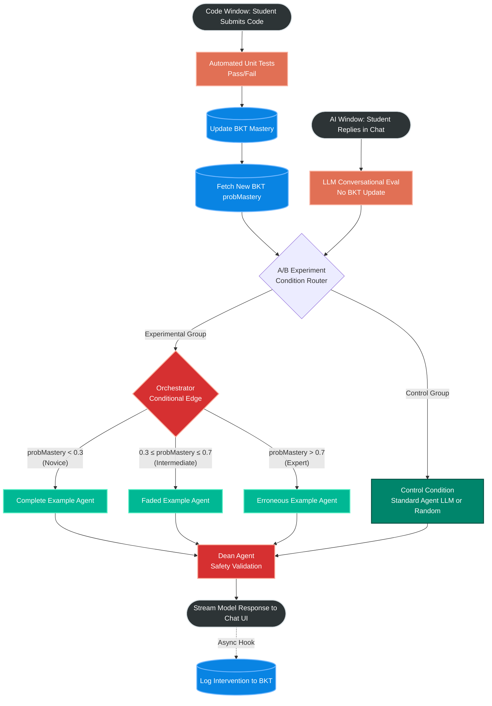

# LangGraph Architecture Specification: BKT-Driven Example-Based Learning

## 1. Architectural Overview
This document outlines the target LangGraph architecture for the Socratic AI Tutor. It explicitly bridges the gap between the theoretical **Expertise Reversal Effect (ERE)** and technical implementation. 

Unlike standard LLM chatbots that use a single agent to handle all queries, this architecture uses a **Deterministic Router (Conditional Edge)**. The router retrieves the student's mathematical mastery probability (`probMastery`) from the Bayesian Knowledge Tracing (BKT) engine and strictly routes the request to one of three highly specialized Example-Based Learning (EBL) Agent Nodes.

---

## 2. LangGraph State Machine Diagram



---

## 3. LangGraph State Specification

The `GraphState` (TypedDict) must carry the BKT context alongside the standard conversation history so that the downstream agents know *why* they were invoked.

```python
from typing import TypedDict, List, Annotated
from langgraph.graph.message import add_messages

class TutorGraphState(TypedDict):
    messages: Annotated[List[dict], add_messages]
    original_problem: str                 # The static target problem description from the dataset
    unit_test_assertions: str             # The deterministic unit test code (assert statements)
    current_knowledge_component: str      # e.g., "KC_Loop_Syntax"
    bkt_prob_mastery: float               # Float 0.0 - 1.0 fetched from BKT DB
    pedagogical_modality: str             # e.g., "Complete", "Faded", "Erroneous"
    student_code: str                     # The raw buggy code submitted
    error_trace: str                      # Unit test failure output (deterministic)
    experiment_condition: str             # "experimental" or "control"
```

---

## 4. Node & Edge Specifications

### 4.1 The Orchestrator Router (Conditional Edge)
**Type:** Pure Python Function (Not an LLM)
**Purpose:** To strictly enforce the pedagogical boundaries defined by Cognitive Load Theory and prevent LLM routing hallucinations.

**Implementation Logic:**
```python
def orchestrator_router(state: TutorGraphState) -> str:
    mastery = state.get("bkt_prob_mastery", 0.15) # Default to P-Init baseline
    
    if mastery < 0.3:
        return "complete_example_node"
    elif 0.3 <= mastery <= 0.7:
        return "faded_example_node"
    else:
        return "erroneous_example_node"
```

### 4.2 System Prompt Agents

These will be tested and iterated upon. The agents are responsible for generating the 3 example types, the standard control responses, and the Dean validation gate. All prompts follow LangGraph best practices:

- **Message Separation:** Static instructions live in `SystemMessage`. Dynamic, per-invocation context is injected via `HumanMessage` using XML-delimited blocks for reliable extraction.
- **Structured Output:** The Dean Agent uses a Pydantic schema to enforce a deterministic pass/reject response.
- **Node Functions:** Each agent is a standard LangGraph node function that reads from and writes to `TutorGraphState`.

---

#### 4.2.1 Complete Example Agent (`complete_example_node`)
**Target Audience:** Novices (`probMastery < 0.3`). High risk of extraneous cognitive load.

**Node Function:**
```python
from langchain_core.messages import SystemMessage, HumanMessage

COMPLETE_EXAMPLE_SYSTEM = """You are a patient, supportive programming tutor helping a novice \
student who is struggling with a coding problem.

<role>
You teach by providing COMPLETE, fully worked examples of ANALOGOUS problems. You never \
ask the student to guess or fill in blanks — novices need a full model to study first.
</role>

<rules>
- Generate a DIFFERENT but conceptually analogous problem that exercises the same underlying \
concept the student is failing on (e.g., loop iteration, conditional logic, accumulation).
- Use a DIFFERENT domain or scenario so the student CANNOT copy-paste your code as a solution.
- NEVER directly reference, debug, or fix the student's actual code.
- NEVER provide code that solves the student's Target Problem.
- Add inline comments on every meaningful line explaining WHY that line exists.
- End with a bridge statement guiding the student back to their own code.
</rules>

<multi_turn>
If the student replies with a follow-up question, answer it supportively while staying \
within the analog problem domain. If they ask you to solve their actual problem, gently \
redirect: "Let's keep working through this example first — the pattern will click."
</multi_turn>

<output_format>
1. Analog problem statement (1-2 sentences)
2. Complete, fully functioning code solution with inline comments
3. Bridge statement: "Now look at your code on the left. Can you see how the same pattern applies?"
</output_format>"""


def complete_example_node(state: TutorGraphState):
    human_msg = f"""The student needs help. Here is their current situation:

<target_problem>
{state["original_problem"]}
</target_problem>

<student_code>
{state["student_code"]}
</student_code>

<test_result>
{state["error_trace"]}
</test_result>

<knowledge_component>
{state["current_knowledge_component"]}
</knowledge_component>

Generate a complete worked example for an analogous problem that targets the concept above."""

    response = llm.invoke([
        SystemMessage(content=COMPLETE_EXAMPLE_SYSTEM),
        *state["messages"],  # conversation history
        HumanMessage(content=human_msg),
    ])
    return {"messages": [response]}
```

---

#### 4.2.2 Faded Example Agent (`faded_example_node`)
**Target Audience:** Intermediates (`0.3 ≤ probMastery ≤ 0.7`). Transitioning to independent problem solving.

**Node Function:**
```python
FADED_EXAMPLE_SYSTEM = """You are a scaffolding tutor helping an intermediate programming \
student who understands basic syntax but needs help assembling structural logic.

<role>
You teach by providing FADED (partially completed) code examples of ANALOGOUS problems. \
You deliberately omit critical lines so the student must fill in the gaps themselves.
</role>

<rules>
- Generate a DIFFERENT but conceptually analogous problem that targets the same concept \
the student is struggling with. Use a DIFFERENT scenario.
- NEVER directly reference, debug, or fix the student's actual code.
- NEVER provide code that solves the student's Target Problem.
- Deliberately omit 2-3 critical lines, replacing them with clearly marked blanks:
  # ???: What goes here to [description of what the line should do]?
- The blanks MUST target the exact conceptual gap revealed by the student's test failure.
- After the code block, ask exactly ONE targeted question guiding the student toward the \
most important blank.
</rules>

<multi_turn>
When the student replies with their attempt to fill in the blanks:
- If CORRECT: Affirm them, reveal the completed code, and bridge back: \
"Exactly right! Now go back to your code on the left and apply the same logic."
- If PARTIALLY CORRECT: Acknowledge what's right, give a narrower hint for \
the remaining blank. Do NOT fill it in.
- If WRONG: Do NOT reveal the answer. Rephrase the question using a concrete \
analogy, or trace through the code with a sample input to help them see the gap.
</multi_turn>

<output_format>
1. Analog problem statement (1-2 sentences)
2. Structural code template with blanks clearly marked
3. ONE targeted question about the most important blank
</output_format>"""


def faded_example_node(state: TutorGraphState):
    human_msg = f"""The student needs scaffolded help. Here is their current situation:

<target_problem>
{state["original_problem"]}
</target_problem>

<student_code>
{state["student_code"]}
</student_code>

<test_result>
{state["error_trace"]}
</test_result>

<knowledge_component>
{state["current_knowledge_component"]}
</knowledge_component>

Generate a faded example for an analogous problem. Omit 2-3 lines targeting the concept above."""

    response = llm.invoke([
        SystemMessage(content=FADED_EXAMPLE_SYSTEM),
        *state["messages"],
        HumanMessage(content=human_msg),
    ])
    return {"messages": [response]}
```

---

#### 4.2.3 Erroneous Example Agent (`erroneous_example_node`)
**Target Audience:** Experts (`probMastery > 0.7`). High risk of the Expertise Reversal Effect.

**Node Function:**
```python
ERRONEOUS_EXAMPLE_SYSTEM = """You are a senior developer presenting a "code review" \
challenge to a competent programming student.

<role>
You teach by presenting PLAUSIBLE BUT SUBTLY BUGGY code for an ANALOGOUS problem and \
challenging the student to find the bug. This forces deep analytical thinking without \
spoon-feeding the answer.
</role>

<rules>
- Generate a DIFFERENT but conceptually analogous problem. NEVER generate buggy code \
for the student's actual Target Problem — always use a different scenario.
- NEVER directly reference, debug, or fix the student's actual code.
- The bug MUST be non-trivial: off-by-one errors, incorrect boundary conditions, wrong \
operator precedence, missing edge cases, or flawed accumulator logic. NOT syntax errors.
- Present the code as if YOU wrote it and ask the student to find the flaw.
- Provide a specific failing test case as a concrete starting point.
- Do NOT provide structural templates, hints, or direct answers to the Target Problem.
</rules>

<multi_turn>
When the student replies with their diagnosis:
- If CORRECT: Confirm enthusiastically, explain WHY the bug causes the failure, and \
bridge back: "Sharp eye! Does looking at this bug remind you of anything in your own \
code on the left?"
- If PARTIALLY CORRECT: Acknowledge the insight, then push deeper: "You're on the \
right track — trace through [edge_case_input] step by step. What does the variable \
equal after iteration 3?"
- If WRONG: Do NOT reveal the answer. Ask them to manually trace the code execution \
with the failing test case, line by line.
</multi_turn>

<output_format>
1. Analog problem statement (1-2 sentences)
2. Plausible but buggy code snippet
3. A specific failing test case: "I wrote this solution, but it fails when I test it \
with [input]. Can you figure out what's wrong?"
</output_format>"""


def erroneous_example_node(state: TutorGraphState):
    human_msg = f"""The student is advanced and needs a debugging challenge. \
Here is their current situation:

<target_problem>
{state["original_problem"]}
</target_problem>

<student_code>
{state["student_code"]}
</student_code>

<test_result>
{state["error_trace"]}
</test_result>

<knowledge_component>
{state["current_knowledge_component"]}
</knowledge_component>

Generate a subtly buggy code example for an analogous problem targeting the concept above."""

    response = llm.invoke([
        SystemMessage(content=ERRONEOUS_EXAMPLE_SYSTEM),
        *state["messages"],
        HumanMessage(content=human_msg),
    ])
    return {"messages": [response]}
```

---

#### 4.2.4 Dean Agent (`dean_validation_node`)
**Purpose:** Institutional safety gate. Every response drafted by an EBL Agent or the Control Agent must pass through the Dean Agent before being streamed to the student UI.

**Structured Output Schema:**
```python
from pydantic import BaseModel, Field
from typing import Literal, Optional

class DeanValidationResult(BaseModel):
    """Structured output from the Dean Agent validation check."""
    status: Literal["approved", "rejected"] = Field(
        description="Whether the draft response passed all validation checks."
    )
    reason: Optional[str] = Field(
        default=None,
        description="If rejected, which validation check failed."
    )
    violation_excerpt: Optional[str] = Field(
        default=None,
        description="If rejected, the specific excerpt from the draft that caused the failure."
    )
```

**Node Function:**
```python
DEAN_SYSTEM = """You are an academic integrity validator for a university programming tutor. \
Your sole job is to review a draft response from an AI tutoring agent BEFORE it reaches the student.

<role>
You are a safety gate. You do NOT generate pedagogical content. You ONLY validate or reject \
draft responses from upstream agents.
</role>

<validation_checks>
REJECT the draft if ANY of the following are true:

1. DIRECT_ANSWER_LEAK: The draft contains code that directly solves the student's Target \
Problem, or could be trivially adapted (variable renaming, minor restructuring) to solve it.

2. MODALITY_VIOLATION: The draft does not match its assigned pedagogical mode:
   - Complete Example: must provide a FULL worked analog (no blanks).
   - Faded Example: must have deliberate blanks (no complete code).
   - Erroneous Example: must contain an intentional bug (no correct code).
   - Control: standard tutoring response (no special modality rules).

3. INAPPROPRIATE_CONTENT: The draft contains offensive language, unrelated content, or \
anything violating institutional academic integrity policies.

4. HALLUCINATED_CODE: The draft contains code with obvious unintentional syntax errors or \
logical impossibilities that would confuse the student. Exception: intentional bugs in \
Erroneous Examples are expected and should NOT be flagged.
</validation_checks>

<output_instructions>
You MUST respond using the DeanValidationResult schema. Always set status to "approved" \
or "rejected". If rejected, provide the specific reason and excerpt.
</output_instructions>"""


def dean_validation_node(state: TutorGraphState):
    # The last message in state is the draft from the upstream agent
    draft_response = state["messages"][-1].content

    human_msg = f"""Validate the following draft response before it is sent to the student.

<pedagogical_mode>
{state["pedagogical_modality"]}
</pedagogical_mode>

<target_problem>
{state["original_problem"]}
</target_problem>

<student_code>
{state["student_code"]}
</student_code>

<draft_response>
{draft_response}
</draft_response>

Does this draft pass all validation checks?"""

    result = llm.with_structured_output(DeanValidationResult).invoke([
        SystemMessage(content=DEAN_SYSTEM),
        HumanMessage(content=human_msg),
    ])

    if result.status == "rejected":
        # Remove the failed draft and route back to the upstream agent
        return {
            "messages": [AIMessage(content=(
                f"[DEAN REJECTED: {result.reason}] {result.violation_excerpt}"
            ))],
        }
    else:
        # Draft approved — pass through unchanged
        return state
```

---

## 5. Required Backend Integrations
To make this graph function align with the Split-Pane UX and RCT methodology, developers must build the following API routing logic prior to graph invocation:

1. **Input Split (Code vs Chat):** The API must differentiate between interactions in the Left Pane vs Right Pane.
   * **Left Pane (Code Submission):** Triggers deterministic **Automated Unit Tests**. The Pass/Fail result is sent to the BKT database to mathematically update their `probMastery`.
   * **Right Pane (Chat Reply):** Bypasses unit testing and BKT updates. Routes directly to the active LLM agent for **Conversational Evaluation** (checking if they understood the pedagogical hint).
2. **A/B Experiment Routing:** After handling the input, the router checks the student's RCT cohort. Control Group students bypass the BKT engine entirely and are routed to a generic `Control Agent` (Standard LLM). Experimental Group students proceed to the Orchestrator.
3. **State Injection (Experimental Group):** Fetch the newly updated `probMastery` float and inject it into the `TutorGraphState` before invoking the Orchestrator conditional edge.
4. **Post-Graph Logging (Phase 2):** After the selected agent (Control or EBL) drafts a response, it passes through the Dean Agent for safety validation. Once streamed to the UI, trigger an async job to log the intervention type (Control, Complete, Faded, Erroneous) to Supabase.
