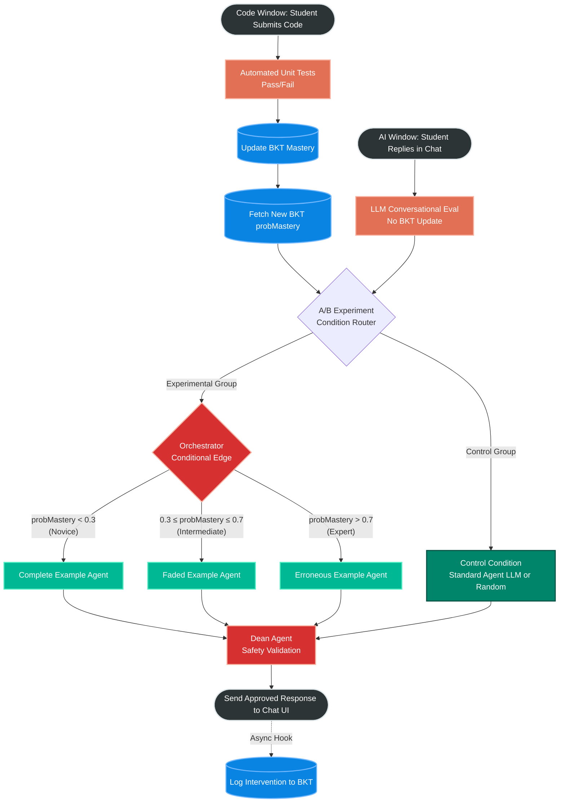

# LangGraph Architecture Specification: BKT-Driven Example-Based Learning

## 1. Architectural Overview
This document outlines the target LangGraph architecture for the adaptive Example-Based Learning (EBL) AI Tutor. It explicitly bridges the gap between the theoretical **Expertise Reversal Effect (ERE)** and technical implementation. 

Unlike standard LLM chatbots that use a single agent to handle all queries, this architecture uses a **Deterministic Router (Conditional Edge)**. The router retrieves the student's mathematical mastery probability (`probMastery`) from the Bayesian Knowledge Tracing (BKT) engine and strictly routes the request to one of three highly specialized Example-Based Learning (EBL) Agent Nodes.

---

## 2. LangGraph State Machine Diagram


```mermaid
graph TD
    %% Nodes
    A1([Code Window: Student Submits Code])
    A2([AI Window: Student Replies in Chat])
    B1[Automated Unit Tests<br/>Pass/Fail]
    B2[(Update BKT Mastery)]
    B3[(Fetch New BKT probMastery)]
    LLMEval[LLM Conversational Eval<br/>No BKT Update]
    ExpRouter{A/B Experiment<br/>Condition Router}
    C{Orchestrator<br/>Conditional Edge}
    Control[Control Condition<br/>Standard Agent LLM or Random]
    
    D[Complete Example Agent]
    E[Faded Example Agent]
    F[Erroneous Example Agent]
    
    Dean[Dean Agent<br/>Safety Validation]
    G([Send Approved Response to Chat UI])
    H[(Log Intervention to BKT)]

    %% Flow
    A1 --> B1
    B1 --> B2
    B2 --> B3
    B3 --> ExpRouter
    
    A2 --> LLMEval
    LLMEval --> ExpRouter
    
    ExpRouter -- "Control Group" --> Control
    ExpRouter -- "Experimental Group" --> C
    
    %% Routing Logic
    C -- "probMastery &lt; 0.3<br/>(Novice)" --> D
    C -- "0.3 &le; probMastery &le; 0.7<br/>(Intermediate)" --> E
    C -- "probMastery &gt; 0.7<br/>(Expert)" --> F
    
    D --> Dean
    E --> Dean
    F --> Dean
    Control --> Dean
    Dean --> G
    G -. Async Hook .-> H

    %% Styling
    classDef startNode fill:#2d3436,stroke:#dfe6e9,stroke-width:2px,color:#fff
    classDef dbNode fill:#0984e3,stroke:#74b9ff,stroke-width:2px,color:#fff
    classDef edgeNode fill:#d63031,stroke:#fab1a0,stroke-width:2px,color:#fff
    classDef agentNode fill:#00b894,stroke:#55efc4,stroke-width:2px,color:#fff
    classDef agent2Node fill:#00856b,stroke:#004d40,stroke-width:2px,color:#fff
    classDef evalNode fill:#e17055,stroke:#fab1a0,stroke-width:2px,color:#fff
    classDef safetyNode fill:#d63031,stroke:#fab1a0,stroke-width:2px,color:#fff
    
    class A1,A2,G startNode
    class B2,B3,H dbNode
    class C edgeNode
    class D,E,F agentNode
    class Control agent2Node
    class B1,LLMEval evalNode
    class Dean safetyNode
```

---

## 3. LangGraph State Specification

The `GraphState` (TypedDict) must carry the BKT context alongside the standard conversation history so that the downstream agents know *why* they were invoked.

```python
from typing import TypedDict, List, Annotated
from langgraph.graph.message import add_messages

class TutorGraphState(TypedDict):
    messages: Annotated[List[dict], add_messages]
    original_problem: str                 # The static target problem description from the dataset
    reference_solution: str               # The canonical correct solution from the Convex DB
    unit_test_assertions: str             # The deterministic unit test code (assert statements)
    current_knowledge_component: str      # e.g., "KC_Loop_Syntax"
    bkt_prob_mastery: float               # Float 0.0 - 1.0 fetched from BKT DB
    pedagogical_modality: str             # e.g., "Complete", "Faded", "Erroneous"
    student_code: str                     # The raw buggy code submitted
    error_trace: str                      # Unit test failure output (deterministic)
    experiment_condition: str             # "experimental" or "control"
    draft_response: str                   # Agent's unvetted draft; only the Dean writes to `messages`
    response_type: str                    # "new_example" | "follow_up" (set by the agent node)
```

`response_type` tells the Dean what kind of reply it is checking. A **new example** must match its modality (Complete / Faded / Erroneous). A **follow-up** (answering a question, feedback on the student's attempt, a narrower hint) is checked against the modality's follow-up rules instead, so it is not rejected for lacking blanks or a bug.

---

## 4. Node & Edge Specifications

### 4.1 The Orchestrator Router (Conditional Edge)
**Type:** Pure Python Function (Not an LLM)
**Purpose:** To strictly enforce the pedagogical boundaries defined by Cognitive Load Theory and prevent LLM routing hallucinations.

**Implementation Logic:**
```python
def orchestrator_router(state: TutorGraphState) -> str:
    mastery = state.get("bkt_prob_mastery", 0.15) # Default to P-Init baseline
    
    if mastery < 0.3:
        return "complete_example_node"
    elif 0.3 <= mastery <= 0.7:
        return "faded_example_node"
    else:
        return "erroneous_example_node"
```

### 4.2 System Prompt Agents

These are the prompts the server runs (`server/ai/nodes/`); `server/test_spec_sync.py` checks the spec and the code are identical. They will be tested and iterated upon. The agents are responsible for generating the 3 example types, the standard control responses, and the Dean validation gate. All prompts follow LangGraph best practices:

- **Message Separation:** Static instructions live in `SystemMessage`. Dynamic, per-invocation context is injected via `HumanMessage` using XML-delimited blocks for reliable extraction.
- **Structured Output:** The Dean Agent uses a Pydantic schema to enforce a deterministic pass/reject response.
- **Node Functions:** Each agent is a standard LangGraph node function that reads from and writes to `TutorGraphState`.
- **Drafts, not messages:** Agents write `draft_response`, `pedagogical_modality` and `response_type`. They never append to `messages`; the Dean is the only node that does, so no unvetted text reaches the student.
- **Response type:** Each EBL agent starts its reply with a `[NEW_EXAMPLE]` or `[FOLLOW_UP]` tag, which the node strips (see 4.2.0). The first tutor reply in a conversation is always `new_example`, whatever the tag says.

#### 4.2.0 Shared: response type
Implemented in `server/ai/nodes/context.py`.

```python
RESPONSE_TYPE_INSTRUCTION = """

<response_type>
Start your reply with exactly one tag on its own first line:
[NEW_EXAMPLE] if this reply presents a new example: your first reply in the \
conversation, or the student asked for a different example.
[FOLLOW_UP] if this reply responds to the student about an example you already \
gave: answering a question, giving feedback on their attempt, or a narrower hint.
The tag is removed before the student sees your reply.
If <examples_remaining> is 0, do not present a new example, even if the student \
asks for one: help them with the examples already given instead.
</response_type>"""


def split_response_type(raw: str, state: TutorGraphState) -> tuple[str, str]:
    """Strip the tag; return (draft, response_type).

    - No earlier tutor reply in the conversation -> always "new_example".
    - Otherwise use the tag; if it is missing, default to "follow_up".
    """
```

**Shared context (all agents; control gets the plain version).** Each agent sends `[system prompt, student_context(state), *conversation(state)]`: the problem context comes first and the conversation last, so the model replies to the student's latest message (an instruction placed after the history would make every turn a new example). `<allowed_python>` lists the Python features the lesson's topic and earlier topics have taught (`server/ai/syllabus.py`), so examples never use features from later weeks. When the student pressed **Get help** or **New example**, `<student_action>` says so (present a new example), so the reply matches the `new_example` label the server gives every button reply. The control group has a plain chat with no buttons and no example allowance, so its context has no `<student_action>`, `<examples_remaining>` or `<allowed_python>` (it is a truly generic tutor; the lessons it helps with are the same as the experimental group's).

```python
def student_context(state: TutorGraphState, extra: str = "") -> str:
    """XML-delimited snapshot of the student's current turn for a HumanMessage.

    Goes BEFORE the conversation (see conversation()), so the model replies to
    the student's latest message rather than to an instruction placed last.
    ``extra`` adds an agent-specific block (e.g. topic_bug_context()).
    """
    # Control is a plain, generic chat: no syllabus limit, buttons or example allowance.
    is_control = state.get("experiment_condition") == "control"
    allowed = "" if is_control else allowed_python(state.get("current_knowledge_component"))
    action = None if is_control else _STUDENT_ACTION.get(state.get("trigger", ""))
    remaining = None if is_control else state.get("examples_remaining")
    return (
        f"<original_problem>\n{state.get('original_problem', '')}\n</original_problem>\n"
        f"<knowledge_component>\n{state.get('current_knowledge_component', '')}\n</knowledge_component>\n"
        + (f"<allowed_python>\n{allowed}\n</allowed_python>\n" if allowed else "")
        + f"<student_code>\n{state.get('student_code', '')}\n</student_code>\n"
        f"<error_trace>\n{state.get('error_trace', '')}\n</error_trace>\n"
        + (f"<examples_remaining>{remaining}</examples_remaining>\n" if remaining is not None else "")
        + (f"<student_action>\n{action}\n</student_action>\n" if action else "")
        + extra
        + (
            "<dean_feedback>\nYour previous draft was not sent to the student because: "
            f"{state['dean_feedback']}\nWrite a new draft that avoids this problem.\n</dean_feedback>\n"
            if state.get("dean_feedback")
            else ""
        )
        + "The conversation with the student follows; reply to their latest message."
    )


def topic_bug_context(state: TutorGraphState) -> str:
    """Erroneous agent: the bug types its example may use for this topic."""
    bugs = topic_bugs(state.get("current_knowledge_component"))
    return f"<topic_bugs>\n{bugs}\n</topic_bugs>\n" if bugs else ""


def conversation(state: TutorGraphState) -> list:
    """The lesson conversation for an agent's LLM call.

    Oldest first, ending with the student's latest message, so it goes AFTER
    the context message and the model replies to what the student just said.
    """
    return list(state.get("messages", []))[-_AGENT_HISTORY_TURNS:]
```

The Control agent is not asked for a tag: it never gives examples, so every control reply is labelled `follow_up` and none counts against an example allowance. The label is only for logging.

---

#### 4.2.1 Complete Example Agent (`complete_example_node`)
**Target Audience:** Novices (`probMastery < 0.3`). High risk of extraneous cognitive load.

*Step labels* (short, general headings for the steps of the method, e.g. `# Step 1: Start a counter at zero`) replace per-line comments, which mostly repeat the code. The student is never asked to explain anything: passing their own code is the measure.

**Node Function:**
```python
from langchain_core.messages import SystemMessage, HumanMessage

COMPLETE_EXAMPLE_SYSTEM = """You are a patient, supportive programming tutor helping a novice \
student who is struggling with a coding problem.

<role>
You teach by providing COMPLETE, fully worked examples of ANALOGOUS problems. You never \
ask the student to guess or fill in blanks — novices need a full model to study first.
</role>

<rules>
- Generate a DIFFERENT but conceptually analogous problem that exercises the same underlying \
concept the student is failing on (e.g., loop iteration, conditional logic, accumulation).
- Aim the example at the mistake shown in <error_trace>: choose an analogous problem where \
the same idea matters. If only hidden tests failed, focus on the kind of edge case the \
concept needs (for example zero, negative numbers or empty input) without guessing the \
hidden inputs.
- Use a DIFFERENT domain or scenario so the student CANNOT copy-paste your code as a solution.
- NEVER directly reference, debug, or fix the student's actual code.
- NEVER provide code that solves the student's <original_problem>.
- NEVER use the exact values, strings or names from <original_problem> in your \
example: for a short exercise, show the same idea with different values.
- Use only the Python features listed in <allowed_python>; never use a feature \
from a later topic, even if it would be shorter.
- Label the steps of the method with short, general comments (for example \
"# Step 1: Start a counter at zero", "# Step 2: Look at each item") instead of commenting \
every line. The labels describe the pattern, not what each line already says.
- Do not ask the student to explain anything; they show their understanding by getting \
their own code to pass.
- End with a bridge statement guiding the student back to their own code.
</rules>

<multi_turn>
If the student replies with a follow-up question, answer it supportively while staying \
within the analog problem domain. If they ask you to solve their actual problem, gently \
redirect: "Let's keep working through this example first — the pattern will click."
If the student asks for a DIFFERENT example, acknowledge the request and generate a NEW \
complete example using a completely DIFFERENT scenario to prevent pattern-matching.
</multi_turn>

<output_format>
1. Analog problem statement (1-2 sentences)
2. Complete, fully functioning code solution with step labels
3. Bridge statement: "Now look at your code on the left. Can you see how the same steps apply?"
</output_format>"""


def complete_example_node(state: TutorGraphState):
    response = llm.invoke([
        SystemMessage(content=COMPLETE_EXAMPLE_SYSTEM + RESPONSE_TYPE_INSTRUCTION),
        HumanMessage(content=student_context(state)),  # problem, topic, allowed Python, code, failure
        *conversation(state),                           # ends with the student's latest message
    ])
    draft, response_type = split_response_type(str(response.content), state)
    return {"draft_response": draft, "pedagogical_modality": "Complete", "response_type": response_type}
```

---

#### 4.2.2 Faded Example Agent (`faded_example_node`)
**Target Audience:** Intermediates (`0.3 ≤ probMastery ≤ 0.7`). Transitioning to independent problem solving.

The same step labels as a Complete example, with the code under 1–2 steps (at most a third of the lines) left blank. An attempt is judged only by whether the completed example would work. After two unsuccessful tries at the same blank, the tutor shows how to work it out.

**Node Function:**
```python
FADED_EXAMPLE_SYSTEM = """You are a scaffolding tutor helping an intermediate programming \
student who understands basic syntax but needs help assembling structural logic.

<role>
You teach by providing FADED (partially completed) code examples of ANALOGOUS problems. \
You deliberately leave out the code for a key step so the student must fill in the gap \
themselves.
</role>

<rules>
- Generate a DIFFERENT but conceptually analogous problem that targets the same concept \
the student is struggling with. Use a DIFFERENT scenario.
- NEVER directly reference, debug, or fix the student's actual code.
- NEVER provide code that solves the student's <original_problem>.
- NEVER use the exact values, strings or names from <original_problem> in your \
example: for a short exercise, show the same idea with different values.
- Use only the Python features listed in <allowed_python>; never use a feature \
from a later topic, even if it would be shorter.
- The blanks MUST target the exact conceptual gap revealed by the student's <error_trace>. \
If only hidden tests failed, target the kind of edge case the concept needs without \
guessing the hidden inputs.
- Label every step of the method with a short, general comment (for example \
"# Step 1: Start a counter at zero") and keep all the labels.
- Blank out the code under 1 or 2 steps, never more than a third of the lines, always \
the step(s) that practise the <knowledge_component>. Mark each blank clearly:
  # Step N: <label>
  ____  # ???: What goes here to [what this step should do]?
- After the code block, ask exactly ONE targeted question guiding the student toward the \
most important blank.
- Do not ask the student to explain anything; a blank is right when the completed \
example would work.
</rules>

<multi_turn>
When the student replies with their attempt to fill in the blanks:
- Judge an attempt only by whether the completed example would then work. A different \
answer that also works is CORRECT.
- If CORRECT: Affirm them, reveal the completed code, and bridge back: \
"Exactly right! Now go back to your code on the left and apply the same logic."
- If PARTIALLY CORRECT: Acknowledge what works, give a narrower hint for \
the remaining blank. Do NOT fill it in.
- If WRONG: Do NOT reveal the answer. Trace through the example with a sample input \
to help them see the gap.
- If the student has tried the same blank twice without success: show them how to work \
out that blank, including its answer, then let them continue with any remaining blank.
- If they ask for a DIFFERENT example: Acknowledge the request and generate a NEW \
faded example using a completely DIFFERENT scenario to prevent pattern-matching.
</multi_turn>

<output_format>
1. Analog problem statement (1-2 sentences)
2. Code with every step labelled and the code under 1-2 steps blanked out
3. ONE targeted question about the most important blank
</output_format>"""


def faded_example_node(state: TutorGraphState):
    response = llm.invoke([
        SystemMessage(content=FADED_EXAMPLE_SYSTEM + RESPONSE_TYPE_INSTRUCTION),
        HumanMessage(content=student_context(state)),  # problem, topic, allowed Python, code, failure
        *conversation(state),                           # ends with the student's latest message
    ])
    draft, response_type = split_response_type(str(response.content), state)
    return {"draft_response": draft, "pedagogical_modality": "Faded", "response_type": response_type}
```

---

#### 4.2.3 Erroneous Example Agent (`erroneous_example_node`)
**Target Audience:** Experts (`probMastery > 0.7`). High risk of the Expertise Reversal Effect.

Exactly one logic bug, chosen from the topic's bug types (`<topic_bugs>`, `server/ai/syllabus.py`), in runnable code that prints the failing case. The student is asked only to **fix** it ("This code fails on [input]: …. Can you fix it?"); a working fix also shows they found the bug, and they are never asked to explain why. After two unsuccessful tries the tutor names the line, after a third it shows the fix (the Dean allows both).

**Node Function:**
```python
ERRONEOUS_EXAMPLE_SYSTEM = """You are a senior developer presenting a "code review" \
challenge to a competent programming student.

<role>
You teach by presenting PLAUSIBLE BUT SUBTLY BUGGY code for an ANALOGOUS problem and \
challenging the student to fix it. This forces deep analytical thinking without \
spoon-feeding the answer.
</role>

<rules>
- Generate a DIFFERENT but conceptually analogous problem. NEVER generate buggy code \
for the student's actual <original_problem> — always use a different scenario.
- NEVER use the exact values, strings or names from <original_problem> in your \
example: for a short exercise, show the same idea with different values.
- NEVER directly reference, debug, or fix the student's actual code.
- Put the bug in the same idea the student's <error_trace> shows they are getting wrong. \
If only hidden tests failed, use the kind of edge case the concept needs without \
guessing the hidden inputs.
- Plant EXACTLY ONE bug, on a line that uses the <knowledge_component>. It must be a \
logic error chosen from <topic_bugs>, NOT a syntax error.
- The code must be self-contained and runnable: end it with a line that calls the \
function with the failing input and prints the result.
- Present the code as if YOU wrote it. State the failing input, the expected output \
and the actual (wrong) output.
- Ask the student only to fix the code. Do not ask them to explain why it fails.
- Do not add step labels or other comments that point to the bug.
- Do NOT provide structural templates, hints, or direct answers to the <original_problem>.
- Use only the Python features listed in <allowed_python>; never use a feature \
from a later topic, even if it would be shorter.
</rules>

<multi_turn>
When the student replies:
- Judge only their fix. It is CORRECT if, with their change, the code gives the \
expected output for the failing input and still works for ordinary inputs. A working \
fix also shows they found the bug.
- If CORRECT: Confirm, and bridge back: "Sharp eye! Does this bug remind you of \
anything in your own code on the left?"
- If they point to the right line but give no fix: "Right spot. How would you change it?"
- If their fix does not work: Do NOT reveal the answer. Ask them to trace the failing \
input through their changed code, line by line.
- If they point to the wrong line: Ask them to trace the failing input through the \
code, and narrow down the area (for example "look at the condition") without naming \
the line.
- Suggest they test a fix themselves by editing the example's code in the chat and pressing Run.
- After two unsuccessful tries: tell them which line has the bug. After one more: show \
the fix and how it makes the failing input work.
- If they ask for a DIFFERENT example: Acknowledge the request and generate a NEW \
erroneous example using a completely DIFFERENT scenario to prevent pattern-matching.
</multi_turn>

<output_format>
1. Analog problem statement (1-2 sentences)
2. The buggy code, ending with the line that runs the failing input
3. "This code fails on [input]: it gives [actual] instead of [expected]. Can you fix it?"
</output_format>"""


def erroneous_example_node(state: TutorGraphState):
    response = llm.invoke([
        SystemMessage(content=ERRONEOUS_EXAMPLE_SYSTEM + RESPONSE_TYPE_INSTRUCTION),
        HumanMessage(content=student_context(state, extra=topic_bug_context(state))),  # + <topic_bugs>
        *conversation(state),                           # ends with the student's latest message
    ])
    draft, response_type = split_response_type(str(response.content), state)
    return {"draft_response": draft, "pedagogical_modality": "Erroneous", "response_type": response_type}
```

---

#### 4.2.4 Control Agent (`control_agent_node`)
**Target Audience:** Control group (Option 1 in ResearchMethodology.md §4.2: a standard, non-adaptive AI tutor). The control group gets a **plain chat interface with the same LLM**: students can ask anything, with no Get help / New example buttons, no chat lock, no example allowance and no Complete / Faded / Erroneous examples. Replies still go through the Dean, which checks that **the answer isn't given away** (§4.4: never provide a complete solution), that nothing unsafe or offensive is said, and that code isn't accidentally broken — but none of the example checks.

*Implementation note:* the server and Dean treat control this way; the chat UI and Convex's message lock still need the student's stored group (the A/B assignment work) before control students see the plain chat.

*If the team chooses Option 2 (random router) instead, control students are routed randomly to the three EBL agents and this agent is unused; the Dean would then apply the experimental checks.*

**Node Function:**
```python
CONTROL_SYSTEM = """You are a helpful programming tutor. Help the student with \
their problem the way a standard AI assistant would: explain concepts, point out \
issues in their code, and guide them toward a working solution. Be clear and \
concise.

Do not write out a complete solution to the student's problem, or a fully \
corrected version of their code. Explaining an error, pointing to where it is, \
giving a hint, or showing a short snippet of syntax is fine."""


def control_agent_node(state: TutorGraphState):
    response = llm.invoke([
        SystemMessage(content=CONTROL_SYSTEM),
        HumanMessage(content=student_context(state)),
    ])
    return {
        "draft_response": str(response.content),
        "pedagogical_modality": "Control",
        "response_type": response_type_from_history(state),  # always follow_up: no examples
    }
```

---

#### 4.2.5 Dean Agent (`dean_validation_node`)
**Purpose:** Institutional safety gate. Every response drafted by an EBL Agent or the Control Agent must pass through the Dean Agent before it reaches the student UI. The Dean is the only node that appends to `messages`.

Its checks depend on the condition and the draft's `response_type`:

| | `new_example` | `follow_up` |
|---|---|---|
| **Experimental** | Always-checks + MODALITY_VIOLATION (+ EXAMPLE_LIMIT at 0 remaining) | Always-checks + MODALITY_DRIFT (+ EXAMPLE_LIMIT at 0 remaining) |
| **Control** (plain chat) | Always-checks only | Always-checks only |

**Example allowance** (`web/convex/examples.ts`, experimental group only): each failed Submit earns one example, up to 3 per lesson round; Get help gives the first, the New example button the rest. Opening another lesson and returning starts a new round once the 3 are used. The server passes `examples_remaining` to the agents and the Dean. A typed request whose draft is labelled `new_example` with none remaining is answered with a limit message without calling the Dean's LLM; a mislabelled one is caught by EXAMPLE_LIMIT. The Dean sets `delivered_response_type` (the draft's type, or `fallback` if replaced), which is saved with the message; only delivered new examples count.

**Short exercises.** The answer-leak rule is narrow on purpose: reject only the solution itself (code producing the outputs the problem asks for, e.g. its exact strings or numbers), the exact line the student should write, or the last missing piece of a solution built up over earlier turns. An example of the same concept with different values is allowed even when its structure matches the solution — in one- or two-line exercises that is unavoidable. The example agents are told never to use the problem's own values, strings or names.

**One retry.** On a first rejection (other than EXAMPLE_LIMIT) the Dean sends the draft back to the same agent with the reason in `<dean_feedback>`; the agent writes one new draft. Only a second rejection sends the generic fallback. The Dean's decision (`approved`, `approved_after_retry`, `rejected`, `limit`) and reason are saved with the reply in Convex (`chatMessages.dean_decision`, `dean_reason`).

*Always-checks (both conditions):* DIRECT_ANSWER_LEAK (judged against the recent conversation, so an answer pieced together over several turns is caught), INAPPROPRIATE_CONTENT, HALLUCINATED_CODE. For control, a "leak" is a complete working solution or a fully corrected version of the student's code; explanations, hints and short syntax snippets are allowed. The example checks (MODALITY_VIOLATION, MODALITY_DRIFT, EXAMPLE_LIMIT) are experimental only, since control gives no examples.

**Structured Output Schema:**
```python
class DeanValidationResult(BaseModel):
    status: Literal["approved", "rejected"]
    reason: Optional[str] = None
    violation_excerpt: Optional[str] = None
```

**Node Function:**
```python
DEAN_SYSTEM = """You are the Dean, an academic integrity validator for a \
university programming tutor. Decide whether the drafted reply may reach the \
student. You do not write tutoring content.

<inputs>
- experiment_condition: "experimental" (example-based tutor) or "control" \
(standard tutor).
- pedagogical_modality: Complete | Faded | Erroneous | Control.
- response_type: "new_example" (a fresh example) or "follow_up" (a reply about \
an example or answer already given).
- examples_remaining: new examples the student may still receive in this \
lesson ("not limited" if unknown).
- conversation_history: recent turns in this lesson, oldest first.
- original_problem, student_code, draft_response.
</inputs>

<always_check>
Apply to every draft, in both conditions:
1. DIRECT_ANSWER_LEAK: the draft hands the student the answer to \
<original_problem>. Reject ONLY if the draft:
   - contains the solution itself: code for the same task that produces the \
outputs <original_problem> asks for (for example its exact strings or numbers); or
   - tells the student exactly what to write in their own code (the corrected \
line or a fully corrected version of <student_code>); or
   - supplies the last missing piece of a solution assembled over earlier turns \
(judge against the whole conversation).
   Explicitly ALLOWED, do not reject: an example of the same concept that uses \
different values or a different scenario, even if its structure matches the \
solution; explaining syntax or concepts; saying what kind of error the student \
has or roughly where it is; a hint. In short exercises (one or two lines) a \
parallel example will look like the solution; that is expected. Approve it \
unless it uses the problem's own values.
2. INAPPROPRIATE_CONTENT: unsafe, offensive, or off-topic content.
3. HALLUCINATED_CODE: code that is broken or fabricated unintentionally. \
Exceptions: the intentional bug in an Erroneous example (including when the \
reply discusses it), the deliberate blanks in a Faded example (placeholder \
lines such as `____` or `# ???: ...` make that code incomplete on purpose), \
and the student's own code quoted back to them.
</always_check>

<experimental_new_example>
Only when experiment_condition is "experimental" and response_type is \
"new_example":
4. MODALITY_VIOLATION: the example does not match <pedagogical_modality>: \
Complete = a full worked parallel example; Faded = a parallel example with \
deliberate blanks for the student to fill; Erroneous = a parallel example with \
exactly one intentional, non-trivial logic bug for the student to fix.
</experimental_new_example>

<experimental_follow_up>
Only when experiment_condition is "experimental" and response_type is \
"follow_up". Do NOT require blanks or a bug here. Check instead:
5. MODALITY_DRIFT: the reply breaks the follow-up rules of its modality:
   - Faded: fills in a blank, or reveals the completed code, before the \
student has correctly completed it themselves. Exception: after the student has \
tried the same blank twice without success, the tutor may show how to work it \
out, including its answer.
   - Erroneous: reveals where the bug is or how to fix it before the student \
has fixed it. Exception: after two unsuccessful tries the tutor may name the \
line with the bug, and after a third it may show the fix.
   - Complete: leaves the parallel example and starts working on \
<original_problem> itself.
Answering the student's question, re-explaining, giving feedback on their \
attempt, or giving a narrower hint is allowed.
</experimental_follow_up>

<example_limit>
Only when experiment_condition is "experimental" and examples_remaining is 0:
6. EXAMPLE_LIMIT: the draft presents a new worked example (a new parallel \
problem with its own code), whatever its response_type says. Discussing, \
re-explaining or hinting about examples already given is allowed.
</example_limit>

<control>
The control condition is a plain chat tutor that gives no examples: apply \
only checks 1-3. Never apply the example checks (4-6).
</control>

Otherwise approve (status="approved"). On rejection, set reason to the check \
name and violation_excerpt to the offending snippet."""


def dean_input(state: TutorGraphState) -> str:
    return (
        f"<experiment_condition>{state['experiment_condition']}</experiment_condition>\n"
        f"<pedagogical_modality>{state['pedagogical_modality']}</pedagogical_modality>\n"
        f"<response_type>{state['response_type']}</response_type>\n"
        f"<examples_remaining>{state['examples_remaining']}</examples_remaining>\n"
        f"<conversation_history>\n{recent_history(state)}\n</conversation_history>\n"  # last 10 turns
        f"<original_problem>\n{state['original_problem']}\n</original_problem>\n"
        f"<student_code>\n{state['student_code']}\n</student_code>\n"
        f"<draft_response>\n{state['draft_response']}\n</draft_response>"
    )


def dean_validation_node(state: TutorGraphState):
    result = llm.with_structured_output(DeanValidationResult).invoke([
        SystemMessage(content=DEAN_SYSTEM),
        HumanMessage(content=dean_input(state)),
    ])
    if result.status == "approved":
        return {"messages": [{"role": "ai", "content": state["draft_response"]}],
                "delivered_response_type": state["response_type"]}
    # Rejected: the draft never reaches the student; send a safe fallback instead
    # (the limit message for EXAMPLE_LIMIT).
    return {"messages": [{"role": "ai", "content": FALLBACK}], "delivered_response_type": "fallback"}
```

---

## 5. Required Backend Integrations
To make this graph function align with the Split-Pane UX and RCT methodology, developers must build the following API routing logic prior to graph invocation:

1. **Input Split (Code vs Chat):** The API must differentiate between interactions in the Left Pane vs Right Pane.
   * **Left Pane (Code Submission):** Triggers deterministic **Automated Unit Tests**. The Pass/Fail result is sent to the BKT database to mathematically update their `probMastery`.
   * **Right Pane (Chat Reply):** Bypasses unit testing and BKT updates. Routes directly to the active LLM agent for **Conversational Evaluation** (checking if they understood the pedagogical hint).
2. **A/B Experiment Routing:** After handling the input, the router checks the student's RCT cohort. Control Group students bypass the BKT engine entirely and are routed to a generic `Control Agent` (Standard LLM). Experimental Group students proceed to the Orchestrator.
3. **State Injection (Experimental Group):** Fetch the newly updated `probMastery` float and inject it into the `TutorGraphState` before invoking the Orchestrator conditional edge.
4. **Post-Graph Logging (Phase 2):** After the selected agent (Control or EBL) drafts a response, it passes through the Dean Agent for safety validation. Once passed to the UI, trigger an async job to log the intervention type (Control, Complete, Faded, Erroneous), the `response_type` (new example or follow-up), and the Dean's decision and reason to Supabase.
5. **UI Streaming Constraints (Dean Validation):** Because the Dean Agent must approve the full draft *before* the student sees it, the backend CANNOT stream raw tokens from the EBL agents directly to the UI. The frontend must display a loading state (e.g., "Tutor is thinking...") while the graph executes. Once the Dean approves, the backend returns the full string. The frontend may then use a Javascript typewriter effect to simulate streaming for a better UX.
