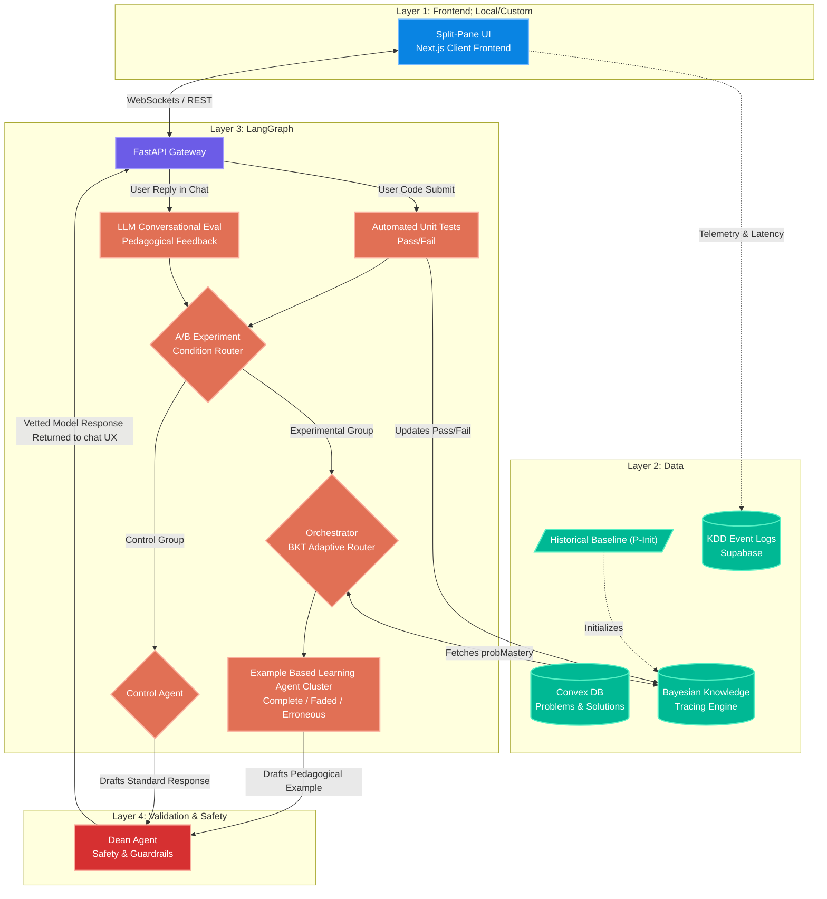
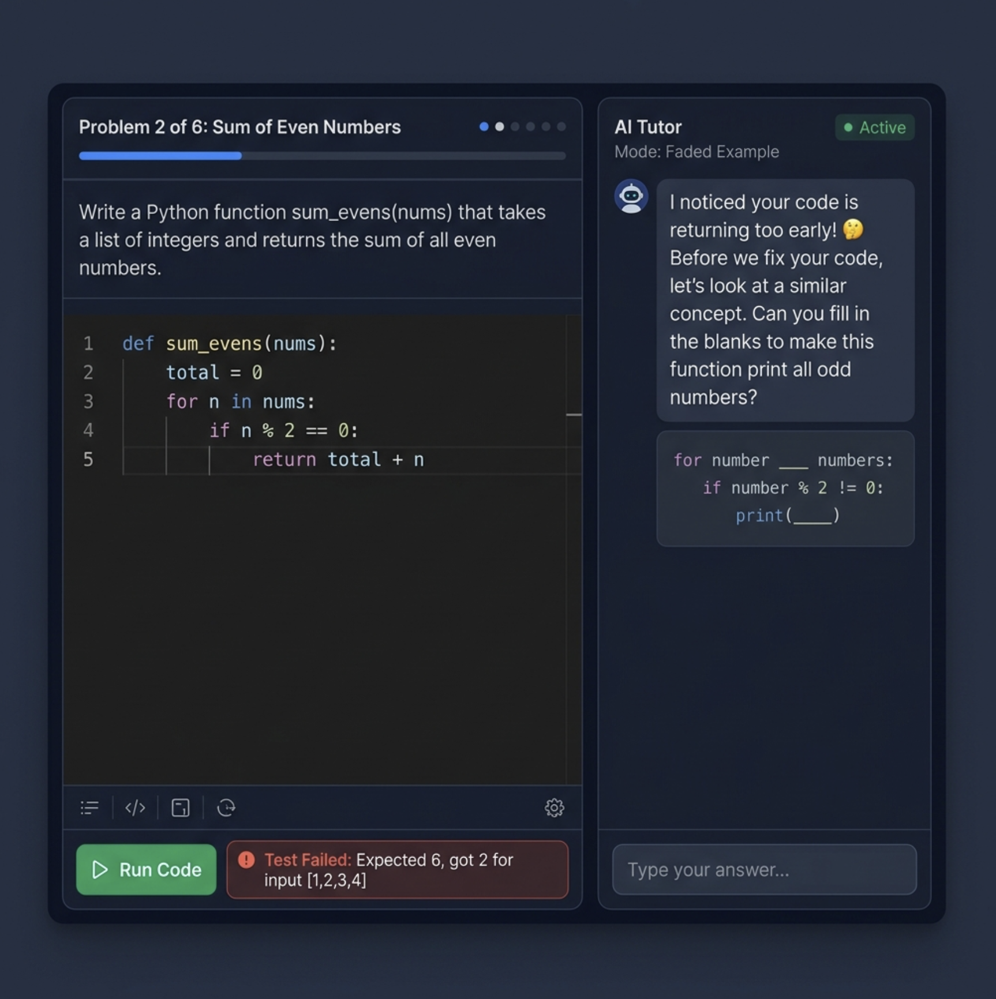

# Research Objectives
Investigate a solution to our Research Question: How can instructors leverage worked and erroneous examples in conjunction with problem-solving strategies to optimize cognitive load, enhance learning outcomes, and meet students' expectations in programming education?

The primary theoretical lens driving the architecture is the **Worked Example Effect**. By modeling student knowledge state using **Bayesian Knowledge Tracing (BKT)**, the system can adaptively deploy pedagogically optimized examples. 
1. For students with low mastery, the system provides **"Complete Examples"** (showing full worked code) to reduce cognitive load. 
2. For students with moderate mastery, the system provides **"Faded Examples"** (showing partial worked code with gaps to fill) to encourage active problem-solving.
3. For students with high mastery, the system deploys **"Erroneous Examples"** (showing intentionally broken code) to foster deeper engagement and error detection skills. 
This adaptive scaffolding is managed by the **LangGraph Engine**, ensuring that the type of pedagogical support is dynamically matched to the student's "epistemological state."

Learn more about: 
- Bayesian Knowledge Tracing: https://en.wikipedia.org/wiki/Bayesian_knowledge_tracing
- Worked Example Effect: https://en.wikipedia.org/wiki/Worked-example_effect

# Participant Experience

## 1. Broader Application Context
Students will login to a custom application hosted by anyone appropriate (not necessarily RMIT). The application will:
- present students with a login window
- collect some metadata
- quiz the student for some quick baseline knowledge
- students are placed into two groups randomly: A Experimental (BKT), and B Control (regular LLM chat)
- An introductory problem is selected from the syllabus(?) or course X
- The student is presented with a dual interface with:
  - code window that can run code and show compiler output (language?)
  - LLM/Chat window that is our custom langGraph agent interface
- The student will attempt to answer a problem by submitting some code,
  - if successful, they will be presented with a new problem
  - if not, the LLM will provide some feedback based on their BKT score
- after each problem the student will answer how much cognitive effort they experienced

---

## 2. System Architecture Diagram

---

## 3. Split-Pane UX Mockup (Layer 1)

The student-facing interface uses a **Split-Pane** layout:

| Pane | Role | Description |
|------|------|-------------|
| **Left Pane (Main Quest)** | Code Editor | Students solve **Static Target Problems** (from HumanEval/MBPP datasets). A "Run Code" button executes **Automated Unit Tests** and returns a deterministic Pass/Fail. |
| **Right Pane (Side Quest)** | AI Tutor Chat | When a student fails a unit test, the LangGraph AI dynamically generates a **pedagogical example** (Complete, Faded, or Erroneous) based on the student's BKT mastery score. The student interacts with the example in the chat, then returns to fix their code. |

---

## 4. The 4 Layers 

### Layer 1: The User Interface

* **Key Components:** A **Next.js(?)** frontend application. (It doesn't have to be Next.js. ): Some studies try to tie in with Canvas or their school's LMS; not necessary for this pilot.

### Layer 2: Data

* **Key Components:** The **Convex Database** hosts the curriculum, storing problem descriptions, starter code, unit tests, canonical solutions, and A/B test tags (`csedm` vs `csedm2`). The **BKT Engine** (running Python libraries like `pyBKT`) calculates the probabilities of mastery based on unit test results. Simultaneously, the **KDD Event Logs** track granular behavioral data (e.g., time spent pausing before typing) which is needed for data analysis and control trial determination. We also need the baseline data set and info stored.

### Layer 3: Generative Reasoning & Routing (LangGraph Engine)

* **Key Components:** The FastAPI gateway splits traffic into two paths. **Code Submits** (Left Pane) trigger Automated Unit Tests. **Chat Replies** (Right Pane) trigger conversational LLM Evaluation. The **A/B Experiment Router** then splits traffic: the Control Group is routed to a standard Control Agent (TBD), while the Experimental Group hits the BKT Orchestrator, which dynamically generates a Complete, Faded, or Erroneous example based on the BKT mastery score.

### Layer 4: The Dean Agent

* **Key Components:** Before any LangGraph response is sent back to the student through the API, it must pass through the **Dean Agent**. If an EBL agent accidentally generated a direct code answer that bypasses the example-based learning scaffolding, the Dean Agent rejects it and forces a rewrite, ensuring cognitive effort is not offloaded to the LLM.
