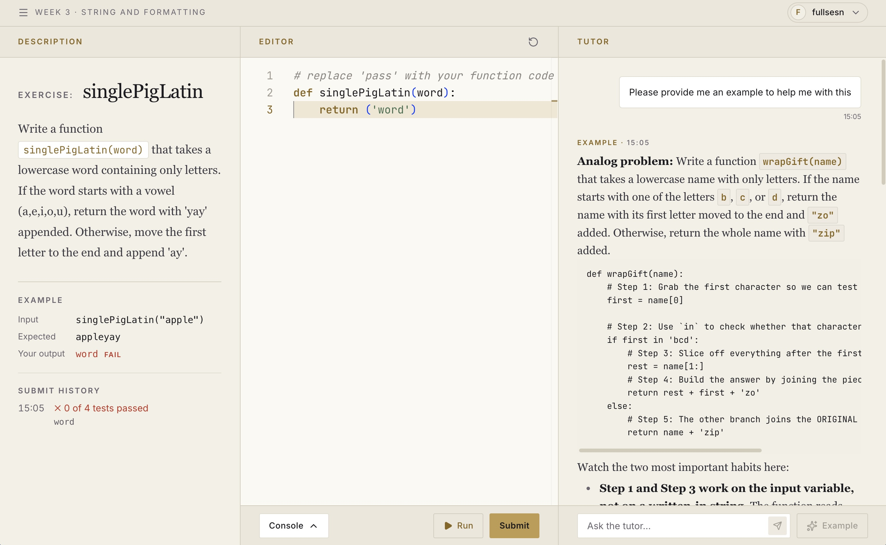

<div align="center">

# ExemplAI

**A BKT-driven adaptive tutor that teaches programming through worked examples.**

[](LICENSE)


[Architecture](Macro_System_Architecture.md) · [Agent Spec](LangGraph_BKT_Architecture_Spec.md) · [Roadmap](TODO.md) · [Changelog](CHANGELOG.md)

</div>

---

## Overview

ExemplAI is a research platform from the **Blockchain Datascience Lab @ RMIT** that studies how
Example-Based Learning (EBL) affects novice programmers. Students solve Python exercises in a
three-column workspace: the exercise, a code editor and an AI tutor side by side. The tutor
tracks each student's mastery with **Bayesian Knowledge Tracing (BKT)** and picks the kind of
example that fits their current level, keeping cognitive load low for beginners and challenge
high for advanced students.



*After a Submit that doesn't pass, **Get help** shows a worked example for an analogous problem,
never the exercise's own solution.*

## Features

- **Adaptive scaffolding.** BKT mastery routes every student to the right example type:

  | Mastery (`probMastery`) | Student level | Example served |
  |---|---|---|
  | `< 0.3` | Novice | **Complete**: a fully worked analog problem |
  | `0.3 – 0.7` | Intermediate | **Faded**: partially completed code with blanks |
  | `> 0.7` | Expert | **Erroneous**: subtly buggy code to debug |

- **A/B experiment support.** Students in the control group get a plain, generic chat tutor instead.
- **Dean validation gate.** A separate agent checks every tutor response before the student sees it, blocking direct answers and solution leaks.
- **Fast replies.** A Get help reply takes about 3.5 s (median; 8.8 s at the 95th percentile): DeepSeek V4.1 Flash writes the examples and gpt-oss-120b runs the guardrail and Dean, via OpenRouter. See the [testing outcome](docs/evaluation/2026-10-07-model-latency.md).
- **Sandboxed code execution.** Student code runs in Judge0 against visible and hidden test cases.
- **Curriculum.** A 12-week Python course built from the CSEDM 2019 dataset, plus original exercises.

## Architecture

| Layer | Responsibility | Technology |
|---|---|---|
| **1 · Frontend** | Split-pane workspace (editor + tutor chat), admin dashboard | TanStack Start, React, Tailwind, Cloudflare Workers |
| **2 · Data** | Courses, lessons, progress, BKT mastery, chat history, auth | Convex, Better Auth, Supabase (agent checkpoints) |
| **3 · Orchestration** | BKT-routed state machine producing Complete / Faded / Erroneous examples | FastAPI, LangGraph, pyBKT |
| **4 · Safety** | Dean Agent that validates every response | LangGraph, Pydantic |

See the [Macro System Architecture](Macro_System_Architecture.md) for the experiment workflow and
UI mockup, and the [LangGraph & BKT Specification](LangGraph_BKT_Architecture_Spec.md) for the
agent graph, routing edges and system prompts.

## Repository Structure

```
.
├── web/        # Student-facing app (TanStack Start + Convex backend functions)
├── admin/      # Admin dashboard (SolidJS)
├── server/     # FastAPI service: LangGraph agents, BKT engine, Judge0 integration
├── data/       # CSEDM 2019 dataset and BKT parameter fitting
└── .github/    # CI/CD: Cloudflare deploys, releases, Supabase keep-alive
```

## Getting Started

### Prerequisites

- [Node.js](https://nodejs.org/) 22+ and [pnpm](https://pnpm.io/)
- [Python](https://www.python.org/) 3.13+ and [uv](https://docs.astral.sh/uv/)
- A [Convex](https://convex.dev/) account, an OpenAI API key, and a Judge0 endpoint

### 1. Backend (`server/`)

```bash
cd server
cp .env.example .env      # fill in Judge0, OpenAI, Convex and database settings
uv sync
uv run fastapi dev main.py
```

### 2. Web app (`web/`)

```bash
cd web
cp .env.example .env.local   # set BETTER_AUTH_SECRET and VITE_BACKEND_URL
pnpm install
npx convex dev               # links a Convex deployment and pushes functions
pnpm seed                    # loads the course and lessons
pnpm dev                     # http://localhost:3000
```

### Running Tests

```bash
cd web && pnpm test                        # Vitest
cd server && uv run --with pytest pytest   # BKT engine tests
```

## Deployment

The web and admin apps deploy to Cloudflare Workers through GitHub Actions:

| Trigger | Environment |
|---|---|
| Pull request to `main` / `dev` | Preview |
| Push to `dev` | Development |
| Manual release from `main` | Production |

Merging to `main` does not deploy. To ship, run **Actions → Automated Release → Run workflow**
on `main`: it bumps the version from the commit messages, updates `CHANGELOG.md`, publishes a
GitHub release, and then deploys the web and admin apps to production.

### Supabase Keep-Alive

Free-tier Supabase projects pause after a week of inactivity, so
[`supabase-keepalive.yml`](.github/workflows/supabase-keepalive.yml) pings the REST API daily at
03:00 UTC. It needs the `SUPABASE_URL` and `SUPABASE_ANON_KEY` repository secrets.

> [!WARNING]
> GitHub disables scheduled workflows in public repos after **60 days without a commit** to the
> default branch. Any commit to `main` resets this; the daily run itself does not. If it gets
> disabled, re-enable it under **Actions → Supabase Keep-Alive → Enable workflow**.

## Roadmap

Open work items are tracked in [TODO.md](TODO.md).

## License

Released under the [MIT License](LICENSE). © 2026 Blockchain Datascience Lab @ RMIT.
